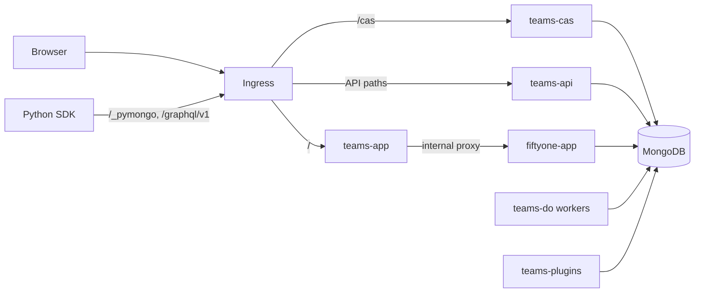

<!-- markdownlint-disable no-inline-html line-length -->
<!-- markdownlint-disable-next-line first-line-heading -->
<div align="center">
<p align="center">


&nbsp;


</p>
</div>
<!-- markdownlint-enable no-inline-html line-length -->

---

# FiftyOne Enterprise: Helm Deployment Guide

FiftyOne Enterprise is the enterprise version of the open source
[FiftyOne](https://github.com/voxel51/fiftyone) project.

The FiftyOne Enterprise Helm chart is the recommended way
to install and configure FiftyOne Enterprise on Kubernetes.

This guide walks you through the steps for installing FiftyOne Enterprise
using Helm.
It also includes advanced configuration and upgrade considerations.
This page assumes general knowledge of FiftyOne Enterprise and how to use it.
Please contact Voxel51 for more information about FiftyOne Enterprise.

## Table of Contents

<!-- toc -->

- [:green_book: Prerequisites Skills and Knowledge](#green_book-prerequisites-skills-and-knowledge)
- [:white_check_mark: Technical Requirements](#white_check_mark-technical-requirements)
- [:clock10: Estimated Completion Time](#clock10-estimated-completion-time)
- [:floppy_disk: Sizing](#floppy_disk-sizing)
- [:wrench: Step 1: Set Up MongoDB Database](#wrench-step-1-set-up-mongodb-database)
- [:closed_lock_with_key: Step 2: Prepare License File](#closed_lock_with_key-step-2-prepare-license-file)
- [:file_folder: Step 3: Choose Authentication Mode](#file_folder-step-3-choose-authentication-mode)
- [:gear: Step 4: Configure `values.yaml`](#gear-step-4-configure-valuesyaml)
- [:file_cabinet: Step 5: Enable Shared Storage](#file_cabinet-step-5-enable-shared-storage)
- [:jigsaw: Step 6: Enable Dedicated Plugins Mode](#jigsaw-step-6-enable-dedicated-plugins-mode)
- [:robot: Step 7: Configure Delegated Operators](#robot-step-7-configure-delegated-operators)
- [:rocket: Step 8: Initial Deployment](#rocket-step-8-initial-deployment)
  - [What Each Service Does](#what-each-service-does)
- [:globe_with_meridians: Step 9: Configure Ingress & TLS](#globe_with_meridians-step-9-configure-ingress--tls)
  - [:compass: Routing Overview (Path-Based Ingress)](#compass-routing-overview-path-based-ingress)
  - [:memo: Notes](#memo-notes)
- [Step 10: Initial CAS Setup](#step-10-initial-cas-setup)
  - [Add First Admin User](#add-first-admin-user)
  - [Enable Auto Join](#enable-auto-join)
- [Step 11: Test End User Login](#step-11-test-end-user-login)
- [Recommended Enhancements](#recommended-enhancements)
  - [:label: Agentic Labeling](#label-agentic-labeling)
  - [:bricks: Custom Plugin Images](#bricks-custom-plugin-images)
- [Upgrades](#upgrades)
- [Known Issues](#known-issues)
- [Advanced Configuration](#advanced-configuration)
- [Validating](#validating)
- [Health Checks and Monitoring](#health-checks-and-monitoring)
- [Values](#values)

<!-- tocstop -->

## :green_book: Prerequisites Skills and Knowledge

A successful, properly secured deployment of FiftyOne Enterprise requires
knowledge of Kubernetes, Helm, MongoDB, DNS, and TLS/SSL certificate management.
See the chart's
[Prerequisites Skills and Knowledge](./fiftyone-teams-app/README.md#prerequisites-skills-and-knowledge)
for the full list.

## :white_check_mark: Technical Requirements

1. Kubernetes Cluster with `kubectl` configured
    1. Use a
       [supported Kubernetes version](https://kubernetes.io/releases/)
       (and matching the kubectl) version `>=1.31-0`
    1. Refer to the Kubernetes
       [Install Tools documentation](https://kubernetes.io/docs/tasks/tools/)
1. Helm version >= 3.14
    1. Refer to the
       [Installing Helm documentation](https://helm.sh/docs/intro/install/)
1. A MongoDB Database that meets FiftyOne's
   [version constraints](https://docs.voxel51.com/user_guide/config.html#using-a-different-mongodb-version).
1. A DNS record (or records) for ingress
1. A TLS/SSL certificate (or certificates) for HTTPS ingress
1. (optional) An NFS server or `ReadWriteMany` compatible storage medium for
   [delegated operators](./fiftyone-teams-app/README.md#builtin-delegated-operator-orchestrator),
   [plugins](./fiftyone-teams-app/README.md#plugins),
   and
   [API high availability](./fiftyone-teams-app/README.md#highly-available-fiftyone-teams-api-deployments)

## :clock10: Estimated Completion Time

Deploying FiftyOne Enterprise takes approximately 2 hours.

## :floppy_disk: Sizing

We recommend the following resource sizing:

| Service             | CPU    | Memory  | Storage         |
|---------------------|--------|---------|-----------------|
| MongoDB             | `4`    | `16Gi`  | 256GB           |
| FiftyOne App        | `1`    | `6Gi`   | 1GB (per pod)   |
| Teams API           | `1`    | `2Gi`   | 1GB (per pod)   |
| Teams App           | `500m` | `512Mi` | 512MB (per pod) |
| Teams CAS           | `500m` | `512Mi` | 512MB (per pod) |
| Delegated Operators | `8`    | `16Gi`  | 1GB (per pod)   |

We also recommend monitoring resource consumption across the services.
Resource usage varies dramatically with operations, use cases,
and dataset sizes.

## :wrench: Step 1: Set Up MongoDB Database

Before deploying FiftyOne Enterprise, you must have a running MongoDB database.
FiftyOne Enterprise supports:

- **MongoDB Atlas** (managed cloud)
- **MongoDB Community Edition** (self-hosted, open source)
- **MongoDB Enterprise** (self-hosted, commercial)

Ensure your MongoDB version meets FiftyOne's
[version constraints](https://docs.voxel51.com/user_guide/config.html#using-a-different-mongodb-version).
We recommend MongoDB 8.0+.

Once your database is running, record your MongoDB connection URI.
You will need it in
[Step 4](#gear-step-4-configure-valuesyaml)
to set `secret.fiftyone.mongodbConnectionString` in your `values.yaml`.
The URI follows this format:

```text
mongodb://<YOUR_USERNAME>:<YOUR_PASSWORD>@<YOUR_MONGODB_HOSTNAME>:27017/?authSource=admin
```

## :closed_lock_with_key: Step 2: Prepare License File

> Required for **v2.0+**

Use the license file provided by the Voxel51 Customer Success Team
to create a license secret:

```shell
kubectl create namespace your-namespace-here
kubectl create secret generic fiftyone-license \
  --namespace your-namespace-here \
  --from-file=license=./your-license-file
```

Set the name of this secret in your `values.yaml`'s `fiftyoneLicenseSecrets` list.
See the example [`values.yaml`](./values.yaml).

> [!TIP]
> When rotating the license,
> restart the `teams-cas` and `teams-api` deployments
> so the new values take effect immediately:
>
> ```shell
> kubectl rollout restart deploy \
>   --namespace your-namespace-here \
>   teams-cas \
>   teams-api
> ```

## :file_folder: Step 3: Choose Authentication Mode

FiftyOne Enterprise supports two authentication modes.
Choose the one that matches your deployment:

| Mode       | Use when                                                                   | `values.yaml` setting                          |
| ---------- | -------------------------------------------------------------------------- | ---------------------------------------------- |
| `internal` | Deployment is Air-gapped or Identity Provider is **OpenID Connect (OIDC)** | `casSettings.env.FIFTYONE_AUTH_MODE: internal` |
| `legacy`   | Identity Provider is **SAML**                                              | `casSettings.env.FIFTYONE_AUTH_MODE: legacy`   |

> [!NOTE]
> The example [`values.yaml`](./values.yaml) ships with
> `casSettings.env.FIFTYONE_AUTH_MODE: legacy` by default.
> Set it to `internal` if your Identity Provider uses OIDC.

Refer to the following docs to set up your Identity Provider
with FiftyOne:

- [Pluggable authentication docs](https://docs.voxel51.com/enterprise/pluggable_auth.html#pluggable-authentication)
  includes information on configuring CAS
- To set up authentication for internal mode: refer to the
  [Getting Started with Internal Mode documentation](https://docs.voxel51.com/enterprise/pluggable_auth.html#getting-started-with-internal-mode)

## :gear: Step 4: Configure `values.yaml`

Edit your `values.yaml` file (see the example
[`values.yaml`](./values.yaml) in this directory) to set:

- `fiftyoneLicenseSecrets` — the name of the secret created in
  [Step 2](#closed_lock_with_key-step-2-prepare-license-file)
- `secret.fiftyone.mongodbConnectionString` — the MongoDB connection URI from
  [Step 1](#wrench-step-1-set-up-mongodb-database)
- `secret.fiftyone.cookieSecret` — a randomly generated string
- `secret.fiftyone.encryptionKey` — used to encrypt storage credentials.
  See
  [Storage Credentials and `FIFTYONE_ENCRYPTION_KEY`](./fiftyone-teams-app/README.md#storage-credentials-and-fiftyone_encryption_key)
  for how to generate it
- `secret.fiftyone.fiftyoneAuthSecret` — a randomly generated shared secret
  used for CAS
- `casSettings.env.FIFTYONE_AUTH_MODE` — the mode chosen in
  [Step 3](#file_folder-step-3-choose-authentication-mode)
- `teamsAppSettings.dnsName` — your ingress hostname
- `namespace.name` — set to match your target namespace
   (e.g. `your-namespace-here`).
   See the note below.

When using the Voxel51 Docker Hub registry to pull container images,
create an image pull secret and reference it in `imagePullSecrets`:

```shell
kubectl create secret generic regcred \
  --namespace your-namespace-here \
  --from-file=.dockerconfigjson=./voxel51-docker.json \
  --type kubernetes.io/dockerconfigjson
```

> [!NOTE]
> This chart uses `namespace.name` from your `values.yaml` to set the
> namespace for all chart resources.
> The Helm `--namespace` flag alone does not control
> where the chart creates resources.
> See the chart's
> [Usage](./fiftyone-teams-app/README.md#usage) section for the full
> `namespace.name` configuration note.

For the full list of available settings, see
[Values](./fiftyone-teams-app/README.md#values).

## :file_cabinet: Step 5: Enable Shared Storage

Dedicated plugins and delegated operators (below) share a common plugin
directory that uses a Kubernetes PersistentVolume (PV)
and PersistentVolumeClaim (PVC).

```yaml
# teams-plugins-pv-pvc.yaml
---
apiVersion: v1
kind: PersistentVolume
metadata:
  name: teams-plugins
spec:
  capacity:
    storage: 10Gi
  accessModes:
    - ReadWriteMany
    - ReadOnlyMany
  nfs:
    server: nfs-server
    path: "/fiftyone_teams_app/plugins"

---
kind: PersistentVolumeClaim
apiVersion: v1
metadata:
  name: teams-plugins
spec:
  accessModes:
    - ReadWriteMany
    - ReadOnlyMany
  storageClassName: ""
  resources:
    requests:
      storage: 10Gi
```

```shell
kubectl apply \
  --namespace your-namespace-here \
  --filename teams-plugins-pv-pvc.yaml
```

For NFS export configuration and cloud-provider alternatives
(Google Filestore, AWS EFS, Azure Files), see
[Adding Shared Storage for FiftyOne Enterprise Plugins](./docs/plugins-storage.md).

## :jigsaw: Step 6: Enable Dedicated Plugins Mode

Add the following to your `values.yaml` to run plugins
in a dedicated `teams-plugins` pod, isolated from `fiftyone-app`:

```yaml
pluginsSettings:
  enabled: true
  env:
    FIFTYONE_PLUGINS_DIR: /opt/plugins
  volumes:
    - name: plugins-vol
      persistentVolumeClaim:
        claimName: teams-plugins-pvc
        readOnly: true
  volumeMounts:
    - name: plugins-vol
      mountPath: /opt/plugins

# teams-api also requires read-write access to the plugins directory
apiSettings:
  env:
    FIFTYONE_PLUGINS_DIR: /opt/plugins
  volumes:
    - name: plugins-vol
      persistentVolumeClaim:
        claimName: teams-plugins-pvc
  volumeMounts:
    - name: plugins-vol
      mountPath: /opt/plugins
```

For full configuration options, see
[Configuring Plugins](./docs/configuring-plugins.md).

## :robot: Step 7: Configure Delegated Operators

Delegated operators let you schedule long-running or compute-heavy tasks
(computing embeddings, model evaluation, dataset import, annotation workflows)
from the FiftyOne UI and run them in dedicated pods.
Choose the mode that fits your workloads:

| Mode           | Use when                                                                                |
| -------------- | --------------------------------------------------------------------------------------- |
| **Always-On**  | Steady or unpredictable delegated-operation volume that needs workers ready immediately |
| **On-Demand**  | Infrequent or GPU-heavy jobs where you don't pay for idle workers                       |

FiftyOne Enterprise 2.14+ provides the configuration for a delegated
operator `teams-do-cpu-default` on CPU nodes in **Always-On** mode.
Enable it by setting
`delegatedOperatorDeployments.deployments.teamsDoCpuDefault.enabled` to
`true` in your `values.yaml`:

```yaml
delegatedOperatorDeployments:
  deployments:
    teamsDoCpuDefault:
      enabled: true
```

Running delegated operators on GPU nodes requires additional configuration.
See
[Leveraging GPU Workloads](./docs/configuring-gpu-workloads.md).
We wrote configuration guides for the major cloud-managed Kubernetes services:

- [Amazon Elastic Kubernetes Service (EKS)](./docs/configuring-gpu-workloads.md#deploying-gpu-enabled-delegated-operator-pods-2)
- [Google Kubernetes Engine (GKE)](./docs/configuring-gpu-workloads.md#deploying-gpu-enabled-delegated-operator-pods)
- [Azure Kubernetes Service (AKS)](./docs/configuring-gpu-workloads.md#deploying-gpu-enabled-delegated-operator-pods-1)

To configure **On-Demand** mode for delegated operators, see
[Using delegatedOperatorJobTemplates for on-demand executors](docs/configuring-delegated-operators.md#using-delegatedoperatorjobtemplates-for-on-demand-executors).
On-demand orchestrators are now auto-registered.

> [!NOTE]
> After configuring an on-demand orchestrator, an admin must
>
> 1. In the FiftyOne Enterprise UI go to *Settings* -> *Orchestrators*
> 1. Select the orchestrator
> 1. Select *Refresh*
>
> This end-to-end tests your job template values
> and makes the orchestrator available as a delegation target in the UI.

## :rocket: Step 8: Initial Deployment

Add the Voxel51 Helm repository and install FiftyOne Enterprise:

```shell
helm repo add voxel51 https://helm.fiftyone.ai
helm repo update voxel51
helm install fiftyone-teams-app voxel51/fiftyone-teams-app \
  --namespace your-namespace-here \
  --values ./values.yaml
```

Confirm all pods are running, including `teams-plugins`
(from [Step 6](#jigsaw-step-6-enable-dedicated-plugins-mode)) and your chosen
delegated operators
(from [Step 7](#robot-step-7-configure-delegated-operators)):

```shell
kubectl get pods \
  --namespace your-namespace-here
```

### What Each Service Does

<!-- markdownlint-disable line-length -->
| Pod | What it does |
| --- | ------------ |
| `fiftyone-app-*` | The core App server — the same visualization engine as open source FiftyOne's `launch_app()`: samples grid, sample modal, filters and aggregations, media serving. It is only reached through `teams-app`'s authenticated proxy, so the ingress you will configure in [Step 9](#globe_with_meridians-step-9-configure-ingress--tls) needs no route to it. |
| `teams-app-*` | The web UI your users browse — dataset listing, settings, runs, and history pages — which embeds the core App by proxying `fiftyone-app`. |
| `teams-api-*` | The control plane — users, roles, dataset permissions, plugin management, delegated operation orchestration, and the MongoDB proxy that SDK connections tunnel through (`/_pymongo`, `/graphql/v1`, `/file`, `/health`). |
| `teams-cas-*` | The Central Authentication Service — every login flows through it. Also handles license validation and serves the super admin console at `/cas`. |
| `teams-plugins-*` | (When dedicated plugins mode is enabled in [Step 6](#jigsaw-step-6-enable-dedicated-plugins-mode)) a dedicated instance of the App server for executing plugin operators in isolation, so heavy plugins cannot impact the main App. |
| `teams-do-*` | Delegated operator workers (from [Step 7](#robot-step-7-configure-delegated-operators)) — they poll the queue and run background jobs (embeddings, exports, brain runs). |
<!-- markdownlint-enable line-length -->

How the services fit together:



## :globe_with_meridians: Step 9: Configure Ingress & TLS

Configure an **Ingress controller** and **TLS termination**
in front of your FiftyOne Enterprise services.
For example, you may generate certificates using
[cert-manager](https://cert-manager.io/)
and apply them to your cloud provider ingress controller or load balancer.

### :compass: Routing Overview (Path-Based Ingress)

| Path                 | Proxied To  | Description                          |
| -------------------- | ----------- | ------------------------------------ |
| `/`                  | `teams-app` | Main web UI                          |
| `/cas`               | `teams-cas` | Central Authentication Service (CAS) |
| `/cloud_credentials` | `teams-api` | Cloud credentials API endpoint       |
| `/graphql/v1`        | `teams-api` | GraphQL API endpoint                 |
| `/rpc`               | `teams-api` | RPC API endpoint                     |
| `/file`              | `teams-api` | File import handling                 |
| `/_pymongo`          | `teams-api` | MongoDB requests via SDK             |
| `/health`            | `teams-api` | Health check endpoint                |

### :memo: Notes

FiftyOne Enterprise supports

- Proxy server traffic routing
  - See the
    [proxy configuration documentation](./docs/configuring-proxies.md)
    for information on how to configure proxies
- Host-based and path-based routing
  - For host-based routing, see
    [Exposing the `teams-api`](./docs/expose-teams-api.md)

For cloud-specific examples of setting up ingress with TLS, see

- [GKE Deployment Guide](./docs/gke-deployment-guide.md)
- [AWS Deployment Guide](./docs/aws-deployment-guide.md)

## Step 10: Initial CAS Setup

In the steps below, `<DNS_NAME>` is the ingress hostname you set for
`teamsAppSettings.dnsName` in [Step 4](#gear-step-4-configure-valuesyaml).

1. Navigate to the CAS Super Admin UI at
   `https://<DNS_NAME>/cas/configurations`
1. In the *API Key* field (upper right corner),
   enter the value of `secret.fiftyone.fiftyoneAuthSecret`
   (from your `values.yaml`) and select *Sign in*

### Add First Admin User

1. Navigate to the *Admins* tab at
   `https://<DNS_NAME>/cas/admins`
1. Select *Add admin*
1. Provide *Name* and *Email*
1. Select *Add*

### Enable Auto Join

1. Navigate to `https://<DNS_NAME>/cas/providers`
1. Select *+ Edit*
1. Select *Allow auto join*
1. Select *Save*

## Step 11: Test End User Login

Verify the deployment's IdP setup by logging in as a regular user

1. In a browser, open `https://<DNS_NAME>`
1. Log in with the credentials of the admin
   (you created in the CAS Super Admin UI)
1. Confirm the login redirects you to the FiftyOne Enterprise datasets page

## Recommended Enhancements

With dedicated plugins and delegated operators configured in
[Step 6](#jigsaw-step-6-enable-dedicated-plugins-mode) and
[Step 7](#robot-step-7-configure-delegated-operators),
consider these additional enhancements for a production-ready deployment.

### :label: Agentic Labeling

The Agentic Labeler service provides few-shot VLM inference via vLLM.
Configure a dedicated GPU delegated-operator worker
(see [Leveraging GPU Workloads](./docs/configuring-gpu-workloads.md)).
Start the service via the FiftyOne Enterprise UI under *Settings* -> *Services*.
For an overview of builtin services and the service orchestrator, see the
[service orchestrator documentation](../docs/configuring-service-orchestrator.md).

### :bricks: Custom Plugin Images

If your delegated operators or plugins need additional dependencies,
build and use custom plugin container images.
Use `voxel51/fiftyone-teams-cv-full` as the base image
(that includes a full CV/ML environment), and extend with:

- Custom Python packages
- Internal SDKs or models

After you build the container image, tag the image,
and push it to your container image registry.
Override the default container image in `values.yaml`:

```yaml
delegatedOperatorDeployments:
  deployments:
    teamsDoCpuDefault:
      image:
        repository: <YOUR_CONTAINER_REGISTRY>/fiftyone-cv-full-custom
        tag: v2.24.0
```

For all the recommended FiftyOne Enterprise configurations, see
[Recommended Post-Installation Configuration](./docs/post-install-recommended-configuration.md).

## Upgrades

Follow this upgrade path:

1. Pull the latest reference files from this repo:

   ```shell
   # from a checkout of https://github.com/voxel51/fiftyone-teams-app-deploy
   git pull origin main
   ```

   > **Note**: This provides the latest example `values.yaml`
   > and upgrade notes for any version-specific changes.

1. Confirm `appSettings.env.FIFTYONE_DATABASE_ADMIN` is set to `false`
   (or unset) in your `values.yaml`:

   ```yaml
   appSettings:
     env:
       FIFTYONE_DATABASE_ADMIN: false
   ```

   > **Note**: This prevents automatic database migrations from running on startup
   > and breaking active SDK sessions.

1. When using [Custom Plugin Images](#bricks-custom-plugin-images),
   rebuild them using the updated base image version.
   For every reference,
   update the tag in `values.yaml` to match the new release.

1. Update your `kubectl` configuration to set your current namespace
   for your `kubectl` context:

   ```shell
   kubectl config set-context \
     --current \
     --namespace your-namespace-here
   ```

1. Update your Voxel51 Helm repository
   and upgrade your FiftyOne Enterprise deployment:

   > [!NOTE]
   > When using Helm v3, replace `--rollback-on-failure` with `--atomic`.
   > If set, Helm will rollback the upgrade to the previous successful release
   > upon failure.

   ```shell
   helm repo update voxel51
   helm upgrade fiftyone-teams-app voxel51/fiftyone-teams-app \
     --namespace your-namespace-here \
     --values ./values.yaml \
     --rollback-on-failure
   ```

   > [!TIP]
   > Before running `helm upgrade`,
   > you may view the changes Helm would apply using the
   > [helm diff](https://github.com/databus23/helm-diff) plugin
   > (Voxel51 is not affiliated with the author of this plugin):
   >
   > ```shell
   > helm diff --context 1 upgrade \
   >   fiftyone-teams-app voxel51/fiftyone-teams-app \
   >   --namespace your-namespace-here \
   >   --values values.yaml
   > ```

For full upgrade guidance, including version-specific migration notes,
refer to [Upgrading](./docs/upgrading.md).

## Known Issues

For a list of common issues and their solutions, refer to the
[Known Issues documentation](./docs/known-issues.md).

If you encounter a new issue,
please open a ticket on the
[GitHub Issues page](https://github.com/voxel51/fiftyone-teams-app-deploy/issues).

## Advanced Configuration

For backup and recovery, secrets management, GPU workloads,
high availability, plugins, proxies, snapshot archival,
storage credentials, static banners, Terms of Service URLs,
text similarity, and workload identity federation,
see the chart's
[Advanced Configuration](./fiftyone-teams-app/README.md#advanced-configuration)
documentation.

## Validating

After deploying FiftyOne Enterprise (with authentication configured),
please follow
[Validating Your Deployment](../docs/validating-deployment.md).

## Health Checks and Monitoring

See the chart's
[Health Checks And Monitoring](./fiftyone-teams-app/README.md#health-checks-and-monitoring)
documentation for basic health assessment
and how to troubleshoot unhealthy pods.

## Values

For the full list of configurable `values.yaml` settings, see the chart's
generated [Values](./fiftyone-teams-app/README.md#values) reference table
or [values.yaml](./fiftyone-teams-app/values.yaml).
